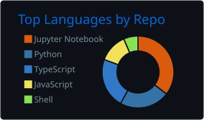
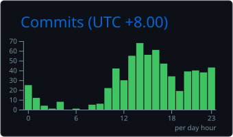

# 👋 Hi, I'm Douglas Chong

*A snapshot of what I've been building*

<table>
  <tr>
    <td align="left" width="50%">

### MPhil in Financial Engineering @ HKUST · Quantitative Research Enthusiast · Developer

I'm an MPhil student in Financial Engineering at HKUST, supervised by Prof. Jiang Wei. I'm interested in using mathematics, statistics, and programming to understand financial markets.

**🌱 Currently Exploring**
- 📈 Quantitative research and quantitative trading
- 📊 Statistical modelling and time-series analysis
- 🤖 Machine learning and AI for financial applications
- 💻 Data-driven software projects

**🔗 Find Me Online**
- 🌐 [ctt062.com](https://ctt062.com/)

    </td>
    <td align="center" width="50%">
      
    </td>
  </tr>
</table>

<table>
  <tr>
    <td align="center" width="50%">
      
    </td>
    <td align="center" width="50%">
      
    </td>
  </tr>
</table>

---

Thanks for visiting! Feel free to connect or discuss quantitative finance, AI, and interesting projects.
